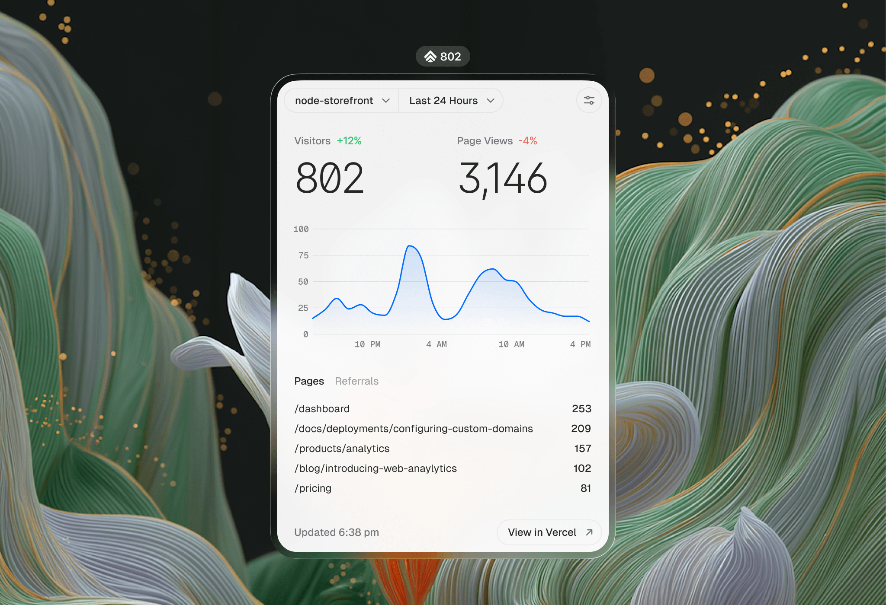

# Analytics Menu Bar

A macOS menu bar app for Vercel Analytics.

## Features

- Visitors, page views, trends, top pages, and referrers
- Last 24 hours, 7 days, and 30 days with equal-period comparisons
- Personal and team project discovery, search, and switching
- Five-minute refreshes with a local stale-data cache
- Optional launch at login

## Privacy and security

The app connects directly to Vercel. Access tokens are stored in the macOS data-protection Keychain and are never written to preferences or logs. Analytics snapshots remain in Application Support with user-only permissions. Disconnecting removes the credential, preferences, and cache.

Network requests use an ephemeral, cache-free, cookie-free session with bounded timeouts and no redirects. Release builds use the App Sandbox and Hardened Runtime. The Debug-only Component Editor is excluded from release builds.

## Requirements

- macOS 14 or later
- Xcode 26 or later with Swift 6
- Homebrew, Node.js 20.16+, and npm 10.8+ for development tools

## Build and test

Launchable Debug builds must use an Apple Development signature so macOS can recognize rebuilt versions as the same app and retain Keychain access. Create the ignored local configuration once:

```sh
cp Config/Local.xcconfig.example Config/Local.xcconfig
```

Replace `YOUR_TEAM_ID` in `Config/Local.xcconfig` with the team identifier shown for your Apple Developer account in Xcode. Keychain Sharing requires a Mac App Development provisioning profile, so register the development Mac with that team in Xcode if prompted. `make run` updates the profile, validates the identity and Keychain access group, and then opens the app.

```sh
make bootstrap
make run
make test
make verify
```

`make test` and `make verify` remain unsigned so they do not require an Apple signing identity or Vercel account. Mock builds are also unsigned and never access account credentials.

For the manual Developer ID, notarization, and GitHub Release workflow, see [Direct macOS releases](docs/direct-release.md).

### One-time Keychain transition

Development builds created before data-protection-only storage may have a legacy credential in the login Keychain. Delete only that legacy item, then reconnect the account once from a development-signed build:

```sh
security delete-generic-password \
  -s VercelAnalyticsBar \
  -a vercel-access-token \
  "$HOME/Library/Keychains/login.keychain-db"
```

An `errSecItemNotFound` result means there is no legacy credential to remove. Current builds never read or migrate the file-based item automatically.

## Optional development tools

```sh
make run-mock                    # local demo data
make run-editor                  # Component Editor with local demo data and hot reload
make probe                       # sanitized Vercel API capability probe
```

The Component Editor accepts only its bundled files or the exact loopback development origin. Demo and Component Editor code is omitted from release builds. The API probe does not persist tokens, identifiers, names, or raw responses.

## API caveat

Dashboard totals use Vercel's undocumented `/web-analytics/v2/overview` endpoint for parity with the Vercel dashboard. This endpoint may change without notice. Charts and breakdowns use the public Web Analytics aggregate endpoint.

## Independence

Analytics Menu Bar is an independent project and is not affiliated with, endorsed by, or operated by Vercel.
Vercel, the Vercel design, Next.js and related marks, designs and logos are trademarks or registered
trademarks of Vercel, Inc. or its affiliates in the US and other countries.

## License

[MIT](LICENSE). Bundled fonts retain their own license files.
